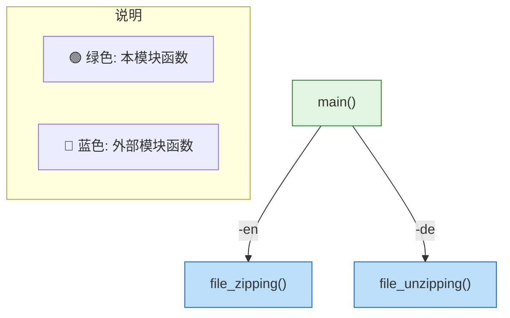
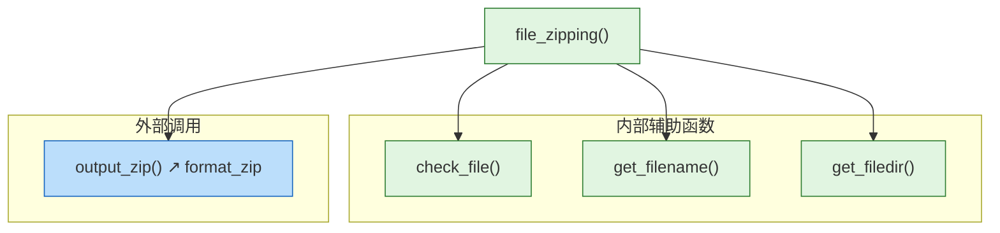
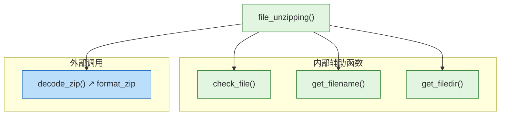
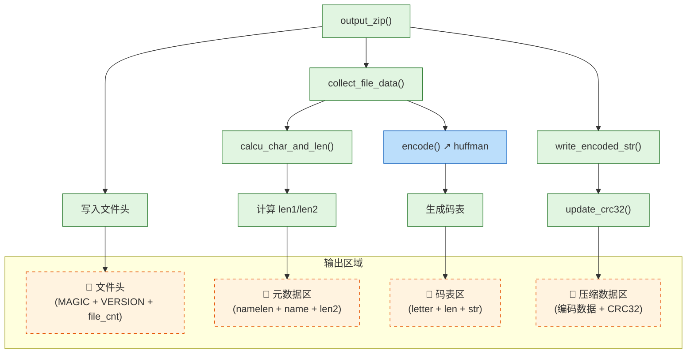
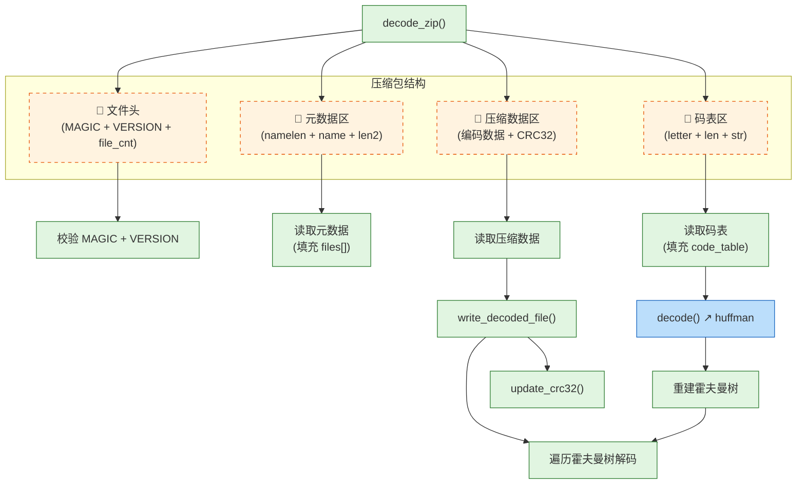
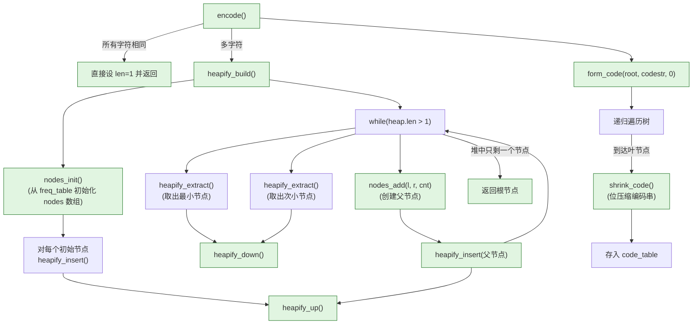
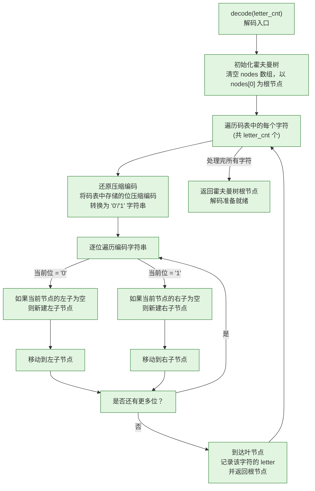
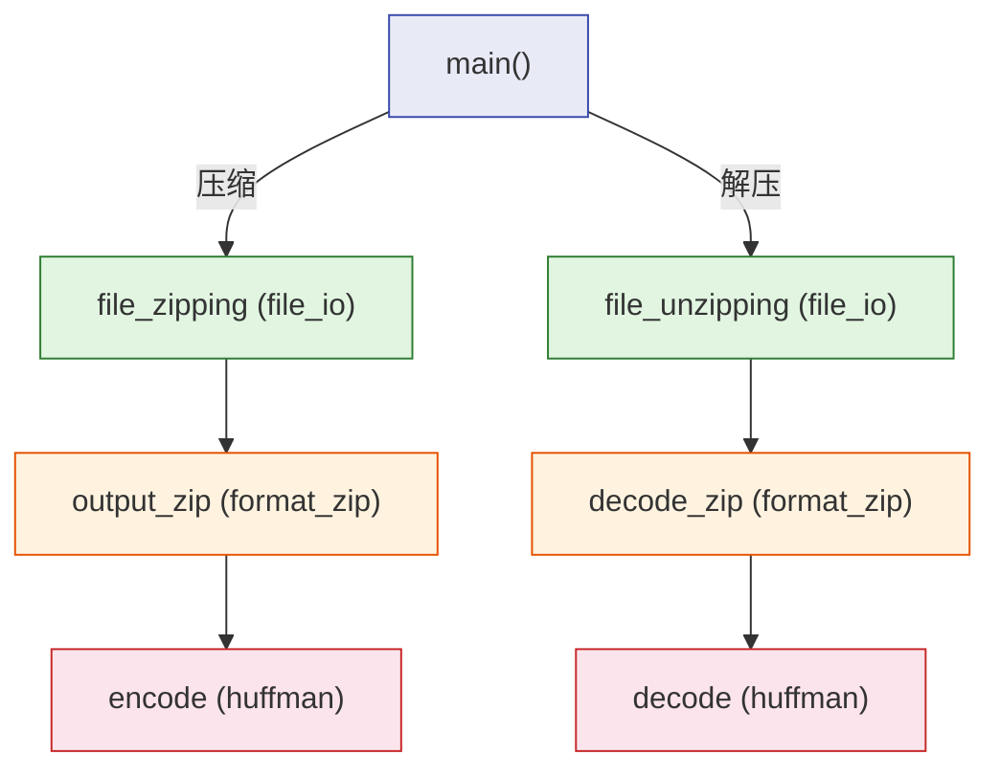

# 项目函数调用关系图 (Mermaid)

## 1. main 模块 (`main.c`)

---

## 2. file_io 模块 (`file_io.c`)

### 2.1 压缩流程

### 2.2 解压流程

---

## 3. format_zip 模块 (`format_zip.c`)

### 3.1 压缩：`output_zip()`

### 3.2 解压：`decode_zip()`

---

## 4. huffman 模块 (`huffman.c`)

### 4.1 编码：`encode()`

（精简版）

### 4.2 解码：`decode()`

---

## 5. 全局跨模块调用总览

---
