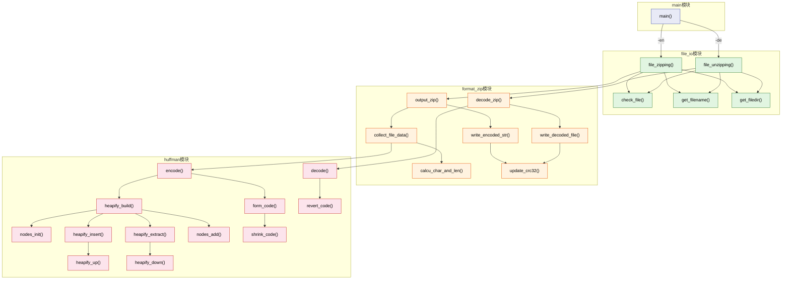

# 系统全景图

## 图1：系统功能模块图（函数调用关系全貌）

---

## 图2：模块数据流图（压缩包格式 + 数据来源 + 数据流动）

```mermaid
flowchart LR
    %% ========== 压缩数据源（左侧） ==========
    subgraph 压缩前数据源
        struct_file["<b>File files[MAX_FILE_NUM]</b><br/>┌───────────────┐<br/>│ name    : 文件名 │<br/>│ path    : 路径   │<br/>│ data    : FILE*  │<br/>│ len1[+] : 原始大小│<br/>│ len2[+] : 压缩大小│<br/>└───────────────┘"]
        struct_freq["<b>freqTable freq_table[256]</b><br/>┌─────────────────┐<br/>│ sum : 总频度      │<br/>│ file[] : 各文件频度│<br/>└─────────────────┘"]
        struct_code["<b>codeTable code_table[256]</b><br/>┌─────────────────┐<br/>│ str[] : 霍夫曼编码 │<br/>│ len   : 编码长度   │<br/>│ letter: 对应字符   │<br/>└─────────────────┘"]
        heap_nodes["<b>static Node nodes[511]</b><br/>┌───────────────┐<br/>│ letter : 字符   │<br/>│ freq   : 频度   │<br/>│ l, r   : 左右子 │<br/>└───────────────┘"]
    end

    %% ========== 压缩包格式（中间） ==========
    subgraph hzip压缩包格式
        direction LR
        magic["4B MAGICNUM<br/>0x7a684d59"]
        version["2B VERSION<br/>0x0001"]
        file_cnt["2B file_cnt"]
        metadata["文件元数据区<br/>(namelen+name+len2)"]
        codetable_area["霍夫曼码表区<br/>(letter_cnt+letter+len+str)"]
        data_area["压缩数据区<br/>(编码数据+CRC32)"]
    end

    version --> file_cnt --> metadata --> codetable_area --> data_area

    %% ========== 压缩输出（右上） ==========
    output_zip_summary["<b>output_zip()</b><br/>压缩总结<br/>耗时 / 大小 / 压缩比"]

    %% ========== 解压输出（右下） ==========
    decode_zip_summary["<b>decode_zip()</b><br/>解压总结<br/>耗时 / 成功数 / 目标目录"]

    %% ========== 压缩数据流向 ==========
    struct_file -- "① file_zipping()" --> struct_freq
    struct_freq -- "② calcu_char_and_len()" --> struct_freq
    struct_freq -- "③ collect_file_data() + encode()" --> heap_nodes
    heap_nodes -- "④ form_code() + shrink_code()" --> struct_code
    struct_code -- "⑤ write_encoded_str()" --> data_area
    struct_file -- "⑥ len1 / len2" --> metadata
    struct_code -- "⑦ 写码表" --> codetable_area
    data_area -- "⑧ 输出总结" --> output_zip_summary

    %% ========== 解压数据流向 ==========
    magic -- "⑨ file_unzipping() 检测" --> version
    metadata -- "⑩ 填充 files[]" --> struct_file
    codetable_area -- "⑪ 填充 code_table" --> struct_code
    struct_code -- "⑫ decode() + revert_code()" --> heap_nodes
    heap_nodes -- "⑬ write_decoded_file() 解码" --> struct_file
    data_area -- "⑭ 读取编码数据" --> write_decoded_file["write_decoded_file()"]
    write_decoded_file -- "⑮ 输出总结" --> decode_zip_summary

    %% ========== 样式 ==========
    classDef dataSource fill:#e3f2fd,stroke:#1565c0,color:#000
    classDef zipFormat fill:#fff3e0,stroke:#e65100,color:#000
    classDef output fill:#e8f5e9,stroke:#2e7d32,color:#000
    classDef decoded fill:#f3e5f5,stroke:#6a1b9a,color:#000

    class struct_file,struct_freq,struct_code,heap_nodes dataSource
    class magic,version,file_cnt,metadata,codetable_area,data_area zipFormat
    class output_zip_summary output
    class decode_zip_summary,write_decoded_file decoded
```

---

### 图2 数据流向说明

| 步骤  | 方向  | 描述                                                              |
| --- | --- | --------------------------------------------------------------- |
| ①→③ | 压缩  | `file_zipping` 读取源文件 → `calcu_char_and_len` 统计频度填充 `freq_table` |
| ③→④ | 压缩  | `collect_file_data` 累加总频度 → 调用 `encode()` 构建霍夫曼树 → 递归生成编码       |
| ④→⑤ | 压缩  | 编码存入 `code_table` → `write_encoded_str` 逐字符编码写入压缩数据区            |
| ⑥→⑦ | 压缩  | `files[i].len1/len2` 写入元数据区 + 码表区                               |
| ⑧   | 压缩  | 输出压缩总结                                                          |
| ⑨→⑩ | 解压  | 检测 MAGICNUM → 读取元数据到 `files[]`                                  |
| ⑪→⑫ | 解压  | 读取码表到 `code_table` → `decode()` 重建霍夫曼树                          |
| ⑬→⑭ | 解压  | 读取编码数据 → 遍历霍夫曼树解码 → 写出恢复文件                                      |
| ⑮   | 解压  | 输出解压总结                                                          |